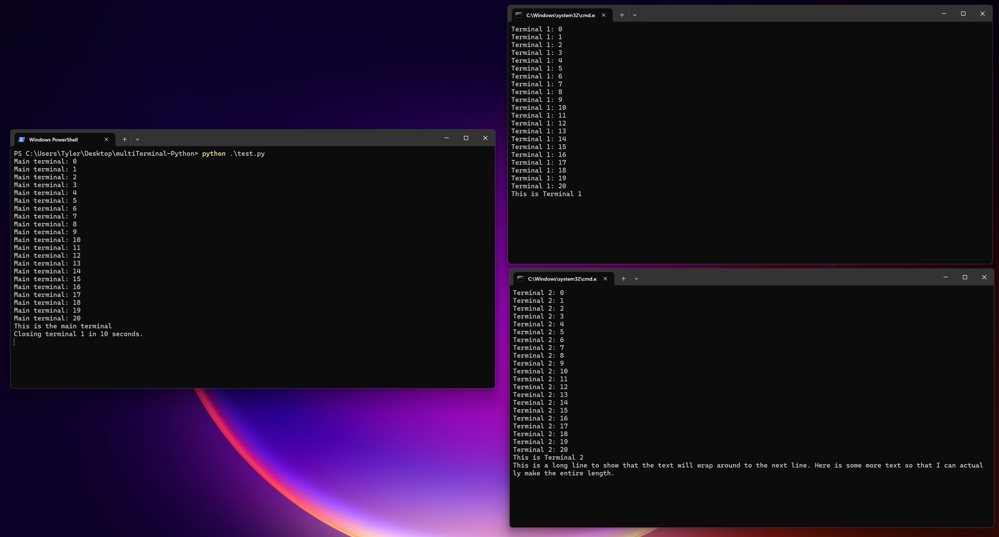
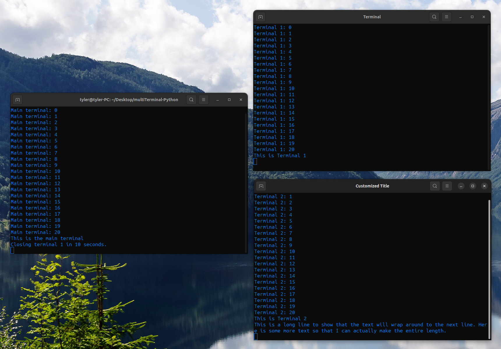
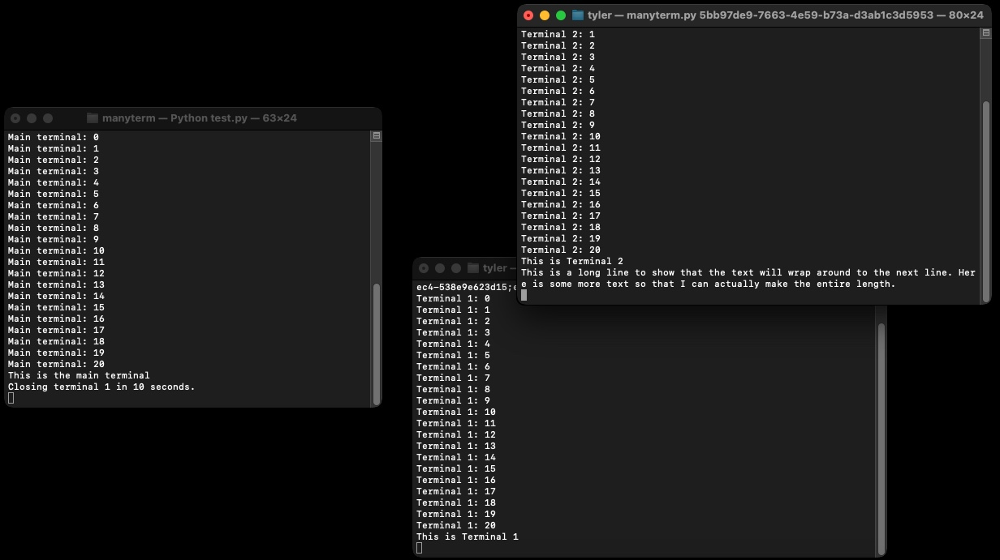

# Manyterm
Spawn multiple terminals to print to.  
Compatible with Windows, Linux, and MacOS.    
### Installation
`pip install manyterm` or `pip3 install manyterm`
### Usage
```py
import manyterm 

t1 = manyterm.Terminal() # init a new window

t1.print("Hello World") # print to the window

t1.print("supercalifragilisticexpialidocious", end="") # default end="\n"

t1.close() # close the window
```
### Description
This program creates multiple terminals in python. New terminals can only be printed to (no input). `tests/test.py` contains an example of how to use this program. A server is used to print to client windows based on a uuid. When a new window object is made `manyterm.Terminal()` the program check to make sure that the server is running, then assigns itself a uuid, and then the program calls itself from a new terminal using the uuid as an argument. The new program contacts the server with its' uuid and the connection is made.
## Windows 11

## Linux (Ubuntu 23.10)

## MacOS Sonoma

