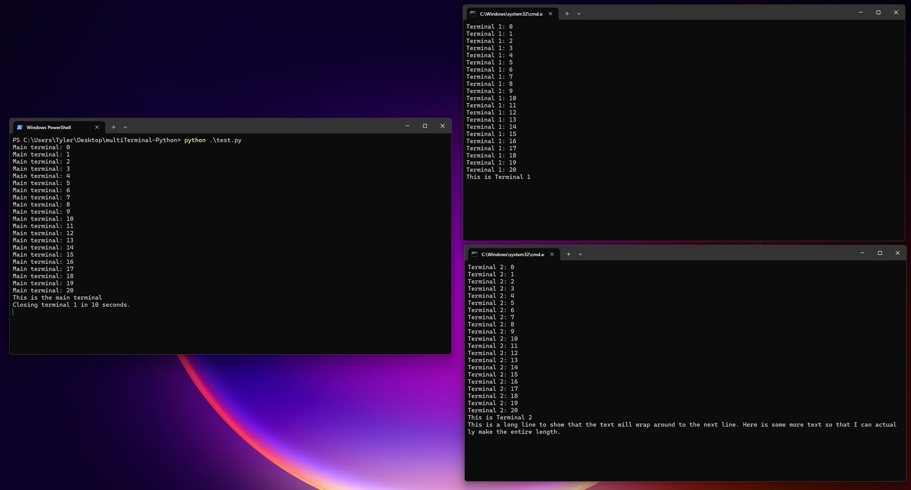
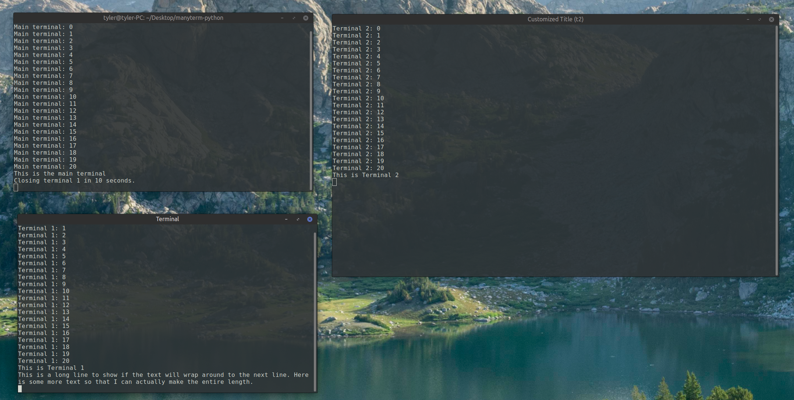
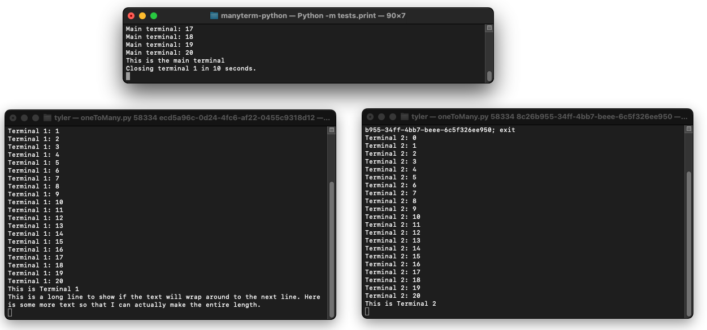

# Manyterm
  [](https://www.paypal.com/donate/?business=8VDFKHMBFSC2Q&no_recurring=0&currency_code=USD)  
Spawn multiple terminals to print to (or get input from).  
Or share terminals between python programs.  
Compatible with Windows, Linux, and MacOS.    
### Installation
`pip install manyterm` or `pip3 install manyterm`
### Usage
```py
import manyterm 

t1 = manyterm.Terminal() # make a new window

t1.print("Hello World") # print to the window

t1.print("supercalifragilisticexpialidocious", end="") # default end="\n"

t1.close() # close the window
```
### Description
There are two types of terminals that can be made:  
1. One to Many `manyterm.Terminal()`:
- New terminals can printed to or be asked for input.  
- `tests/print.py` is an example of how to use printing.  
- `tests/input.py` is an example of how to use input.  
2. Many to One `manyterm.SharedTerminal()`: 
- Create a "shared" terminal that can be accessed from many independent python programs.  
- Run several instances of `tests/shared.py` concurrently to share one terminal.  
- Each instance will connect to the terminal based on the uid.  
- Then run `tests/close_shared.py` to close the terminal.  

Notes:
* Terminals are probably not thread safe.
* No errors will be thrown if trying to print to a closed terminal, however if you are using One to Many then you can check the boolean return of print to see if it was successful.  
* The title of the window can be changed in Linux with the `title` parameter.  
* The size of the window can be changed in Linux and Windows with the `cols` and `rows` parameter, unit is characters.


### How it works:
A server is used to print to client windows based on a uuid. When a new window object is made `manyterm.Terminal()` the program checks to make sure that the server is running, assigns itself a uuid, and then the program calls itself from a new terminal using the uuid as an argument. The new program contacts the server with its' uuid and the connection is made. For "Many to One" the window becomes the server and the user program becomes the client.

## Windows 11

## Linux (Mint 22.1)

## MacOS Sonoma

