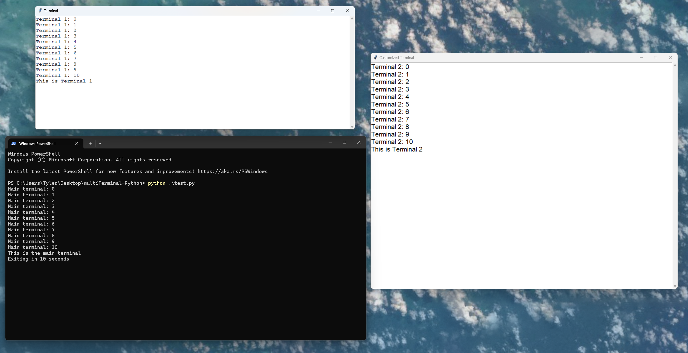

# multiTerminal-Python
This program uses threading to create multiple tkinter terminals in python. New terminals can only be printed to (no input). `test.py` contains an example of how to use this program. In short, import statement: `from multiTerminal import terminal`, then create a new terminal, "t1": `t1 = terminal()`, and you can print via: `t1.print("Hello World")`. There are also customization options shown in the `test.py` file. If you want to ignore closed prints (i.e. if the user closes the terminal) then add the argument `ignoreClosedPrints=True`. You can also disallow the user to close the window with `allowClosing=False`.

