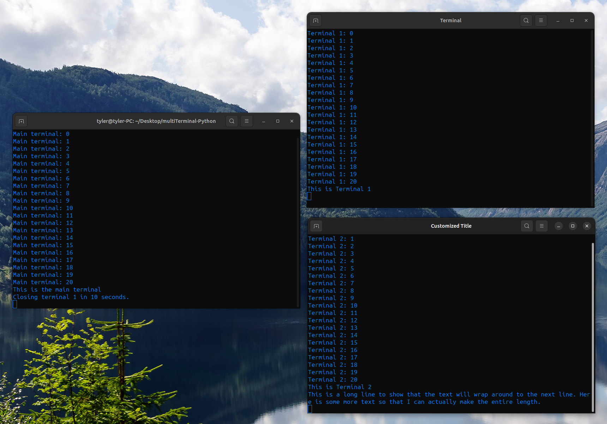
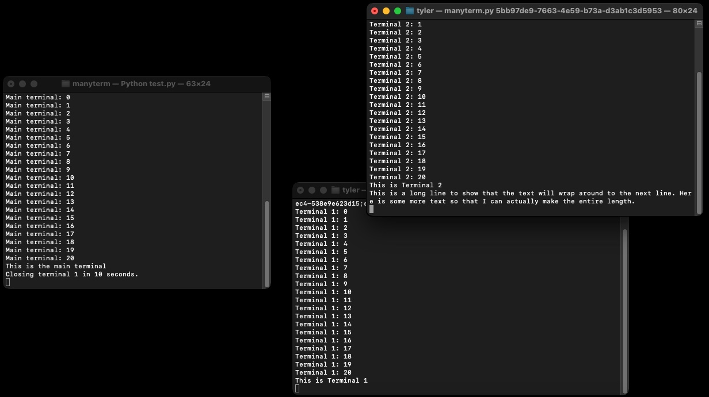

.. Manyterm documentation master file, created by
   sphinx-quickstart on Mon Dec 23 22:08:12 2024.
   You can adapt this file completely to your liking, but it should at least
   contain the root `toctree` directive.

Manyterm Documentation
====================================
.. image:: https://img.shields.io/pypi/v/manyterm
   :alt: PyPI - Version

.. image:: https://img.shields.io/pypi/dm/manyterm
   :alt: PyPI - Downloads

.. image:: https://img.shields.io/badge/Donate-PayPal-green.svg
   :target: https://www.paypal.com/donate/?business=8VDFKHMBFSC2Q&no_recurring=0&currency_code=USD
   :alt: Donate

Spawn multiple terminals to print to.
Compatible with Windows, Linux, and MacOS.

.. autosummary::
   :toctree: _autosummary
   :template: custom-module-template.rst
   :recursive:

   mypackage

Installation
------------

:code:`pip install manyterm`
or
:code:`pip3 install manyterm`

Usage
-----

.. code:: py

   import manyterm

   t1 = manyterm.Terminal() # init a new window

   t1.print("Hello World") # print to the window

   t1.print("supercalifragilisticexpialidocious", end="") # default end="\n"

   t1.close() # close the window

Description
-----------

This program creates multiple terminals in python. New terminals can only be printed to (no input). :code:`tests/test.py` contains an example of how to use this program. A server is used to print to client windows based on a uuid. When a new window object is made :code:`manyterm.Terminal()` the program checks to make sure that the server is running, then assigns itself a uuid, and then the program calls itself from a new terminal using the uuid as an argument. The new program contacts the server with its' uuid and the connection is made.

Windows 11
^^^^^^^^^^
.. image:: screenshots/screenshot-win.png

Linux (Ubuntu 23.10)
^^^^^^^^^^^^^^^^^^^^

MacOS Sonoma
^^^^^^^^^^^^
